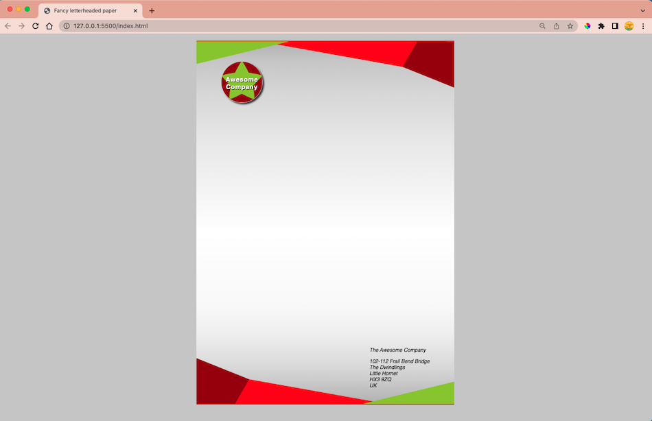

# Final Project (preview)

Link: https://jasheloper.github.io/css-letterheaded-paper/

 

## Objective
To test comprehension of CSS box model, and other box-related features such as implementing backgrounds.

 

## Project Guidelines
https://developer.mozilla.org/en-US/docs/Learn/CSS/Building_blocks/Creating_fancy_letterheaded_paper